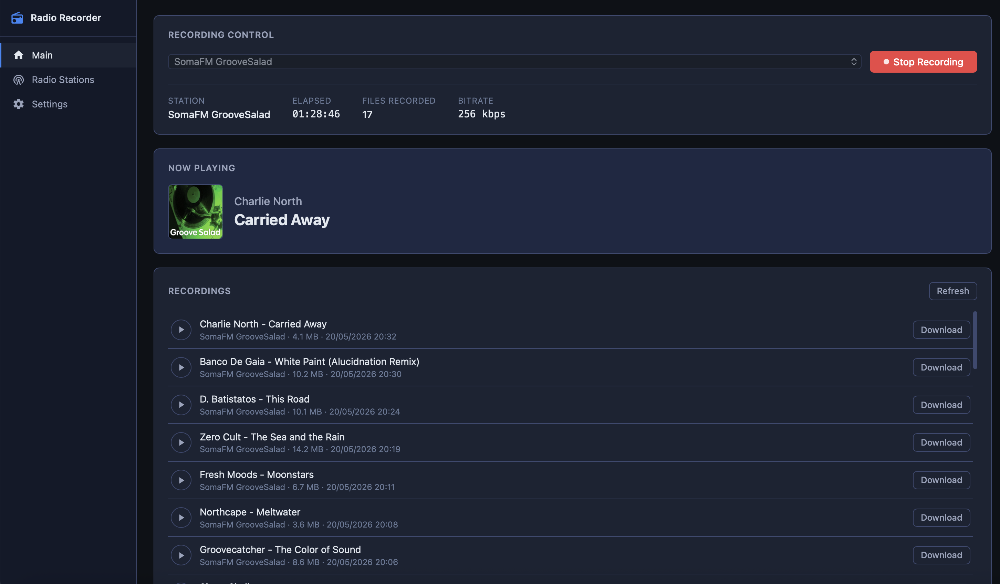

# RadioRecord

A web-based internet radio recorder built with Vue 3 + Express. Select a station, hit record, and it saves the stream as tagged MP3 files directly to your server.



## Features

- Record internet radio streams to MP3
- ID3 tag support via `node-id3`
- Manage stations (add/remove stream URLs + logos)
- Real-time recording status over WebSocket
- Settings page for output directory and schedule
- Vue 3 frontend served by an Express backend

## Tech Stack

| Layer    | Technology              |
|----------|-------------------------|
| Frontend | Vue 3, Vite             |
| Backend  | Node.js (ESM), Express  |
| Tags     | node-id3                |
| Realtime | WebSocket (ws)          |

## Getting Started

```bash
npm install

# Development
npm run dev

# Production
npm run build
npm start
```

The app runs on the port configured in `config/settings.json`. Open it in your browser to start recording.

## Configuration

- **`config/stations.json`** — list of radio stations (id, name, stream URL, logo URL)
- **`config/settings.json`** — output directory and other settings
